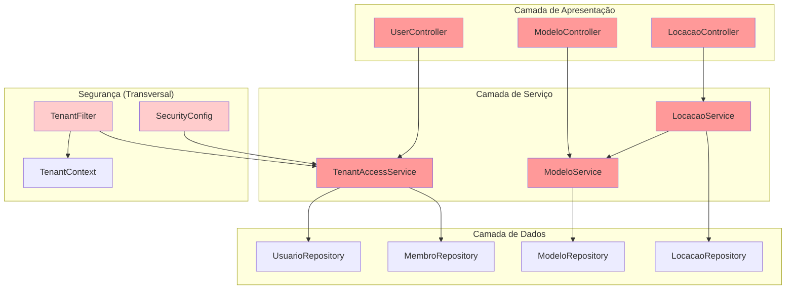
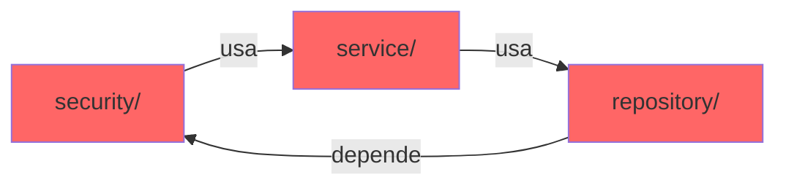
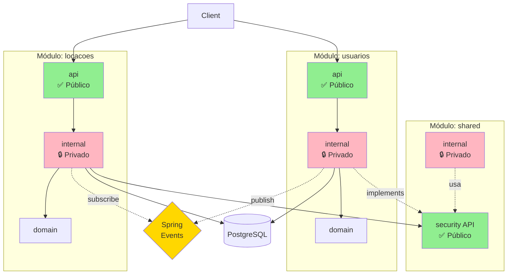
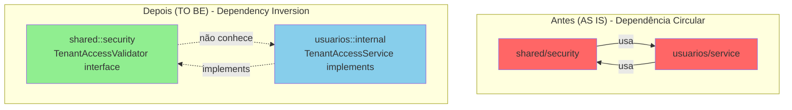
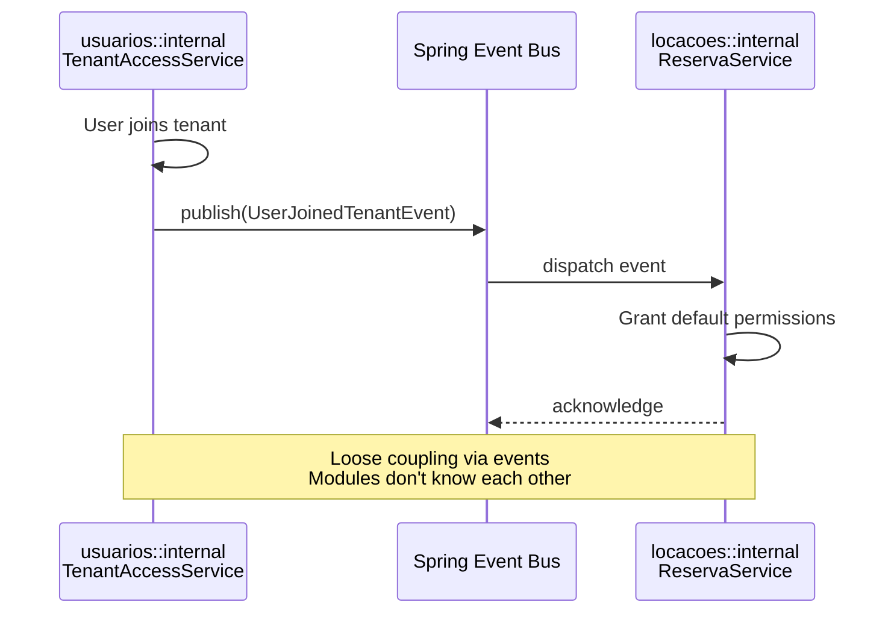
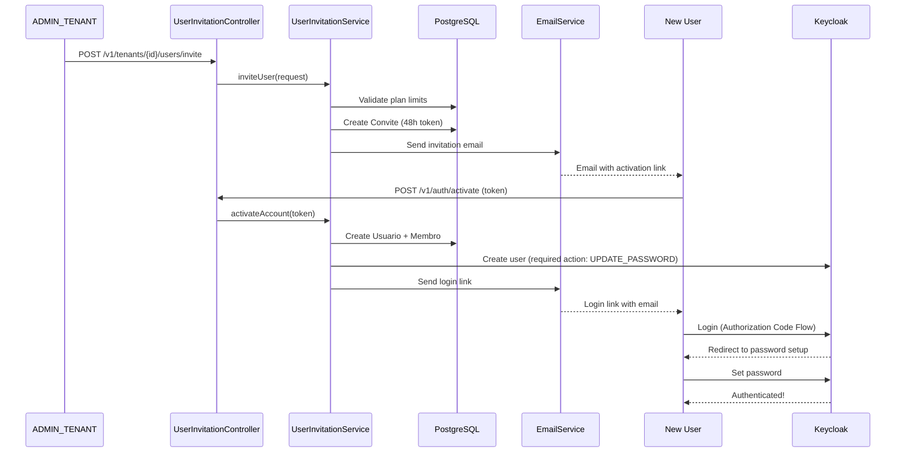
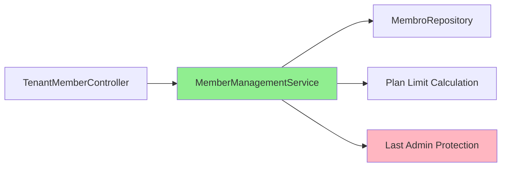

# Arquitetura - Evolução para Monolito Modular

Este documento detalha a evolução da arquitetura do Jetski SaaS de um monolito tradicional para um monolito modular usando Spring Modulith.

## 📊 Visão Geral da Evolução

### Linha do Tempo

```
v0.1.0 (AS IS)                    v0.2.0 (TO BE)                    v1.0+ (FUTURO)
───────────────────────────────────────────────────────────────────────────────
Monolito Tradicional       →      Monolito Modular           →      Microserviços
                                                                     (se necessário)

• Acoplamento alto                • Módulos independentes            • Serviços distribuídos
• Dependências circulares         • Boundaries claros                • Comunicação via API
• Difícil testar                  • Testes de arquitetura            • Escalabilidade granular
• Preparação complexa             • Preparado para split             • Complexidade operacional

❌ Problemas                      ✅ Benefícios                       ⚖️ Trade-offs
```

## AS IS - Monolito Tradicional (até v0.1.0)

### Estrutura de Pacotes

```
com.jetski/
├── config/              # ⚠️ Configuração misturada
├── domain/              # ⚠️ Todas as entidades juntas
│   ├── Usuario
│   ├── Membro
│   ├── Modelo
│   ├── Jetski
│   ├── Reserva
│   └── Locacao
├── repository/          # ⚠️ Todos os repositórios acessíveis
├── service/             # ⚠️ Lógica de negócio misturada
│   ├── TenantAccessService    # Deveria estar em usuarios
│   ├── ModeloService
│   └── LocacaoService
├── controller/          # ⚠️ Todos os controllers juntos
├── security/            # ⚠️ Segurança acessível por todos
│   ├── TenantContext
│   ├── TenantFilter
│   └── SecurityConfig
└── dto/                 # ⚠️ DTOs compartilhados sem controle
```

### Diagrama de Dependências (AS IS)



### Problemas Identificados

#### 1. Dependências Circulares



**Exemplo real:**
```java
// security/TenantFilter.java
public class TenantFilter {
    private TenantAccessService service; // ⚠️ Depende de service/
}

// service/TenantAccessService.java
public class TenantAccessService {
    private MembroRepository membroRepo; // ⚠️ Depende de repository/
}

// config/SecurityConfig.java
public class SecurityConfig {
    private TenantAccessService service; // ⚠️ Depende de service/
}

// ❌ CICLO: security/ → service/ → repository/ → security/
```

#### 2. Acoplamento Alto

```java
// ❌ ModeloService depende de múltiplos serviços não relacionados
public class ModeloService {
    private ModeloRepository modeloRepo;
    private TenantAccessService tenantService;  // Não deveria!
    private UsuarioService usuarioService;      // Não deveria!
    private AuditoriaService auditoriaService;  // Ok (transversal)
}
```

#### 3. Limites de Contexto Indefinidos

```
Qual é o limite entre:
- Gestão de Usuários?
- Gestão de Locações?
- Gestão de Modelos?
- Infraestrutura compartilhada?

❌ Não está claro!
```

#### 4. Dificuldade para Testes

```java
// ❌ Para testar ModeloService, preciso mockar:
@Mock TenantAccessService tenantService;
@Mock UsuarioService usuarioService;
@Mock AuditoriaService auditoriaService;
@Mock ModeloRepository modeloRepo;
// ... muitas dependências!
```

#### 5. Preparação para Microserviços Complexa

```
Se precisarmos extrair "Locacoes" como microserviço:
1. Identificar todas as dependências (difícil!)
2. Encontrar dependências circulares (manual!)
3. Refatorar código para quebrar ciclos
4. Definir contratos de API
5. Migrar dados
6. Testar comunicação entre serviços

⏱️ Estimativa: 4-6 semanas
```

---

## TO BE - Monolito Modular (v0.2.0+)

### Estrutura de Módulos

```
com.jetski/
│
├── shared/                              # 🟦 MÓDULO: Shared Infrastructure
│   ├── security/                        # ✅ Named Interface (API pública)
│   │   ├── TenantAccessValidator.java   # Interface
│   │   ├── TenantAccessInfo.java        # DTO
│   │   ├── TenantContext.java           # ThreadLocal
│   │   ├── SecurityConfig.java          # Configuration
│   │   └── package-info.java            # @NamedInterface("security")
│   │
│   ├── authorization/                   # OPA integration
│   │   ├── OPAAuthorizationService.java
│   │   └── dto/
│   │
│   ├── exception/                       # Global exception handling
│   ├── config/                          # Shared configuration
│   │
│   ├── internal/                        # 🔒 PRIVADO - Não acessível
│   │   ├── TenantFilter.java
│   │   ├── JwtAuthenticationConverter.java
│   │   └── FilterChainExceptionFilter.java
│   │
│   └── package-info.java                # @ApplicationModule
│
├── usuarios/                            # 🟦 MÓDULO: Users and Members
│   ├── api/                             # ✅ API pública
│   │   ├── UserTenantsController.java
│   │   ├── UserInvitationController.java         # ✨ NEW (v0.5.0)
│   │   ├── AccountActivationController.java      # ✨ NEW (v0.5.0)
│   │   ├── TenantMemberController.java           # ✨ NEW (v0.5.0)
│   │   └── dto/
│   │       ├── TenantSummary.java
│   │       ├── UserTenantsResponse.java
│   │       ├── InviteUserRequest.java            # ✨ NEW
│   │       ├── InviteUserResponse.java           # ✨ NEW
│   │       ├── ActivateAccountRequest.java       # ✨ NEW
│   │       ├── ActivateAccountResponse.java      # ✨ NEW
│   │       ├── ListMembersResponse.java          # ✨ NEW
│   │       ├── MemberSummaryDTO.java             # ✨ NEW
│   │       └── DeactivateMemberResponse.java     # ✨ NEW
│   │
│   ├── domain/                          # Entidades de domínio
│   │   ├── Usuario.java
│   │   ├── Membro.java
│   │   ├── Convite.java                          # ✨ NEW (v0.5.0)
│   │   └── event/
│   │       └── UserAccountActivatedEvent.java    # ✨ NEW (v0.5.0)
│   │
│   ├── internal/                        # 🔒 PRIVADO - Não acessível
│   │   ├── TenantAccessService.java     # Implementa TenantAccessValidator
│   │   ├── UserInvitationService.java            # ✨ NEW (v0.5.0)
│   │   ├── MemberManagementService.java          # ✨ NEW (v0.5.0)
│   │   ├── UserActivationEmailListener.java      # ✨ NEW (v0.5.0)
│   │   ├── UsuarioGlobalRoles.java
│   │   └── repository/
│   │       ├── MembroRepository.java
│   │       ├── ConviteRepository.java            # ✨ NEW (v0.5.0)
│   │       └── UsuarioGlobalRolesRepository.java
│   │
│   └── package-info.java                # @ApplicationModule(allowedDependencies = "shared::security")
│
└── locacoes/                            # 🟦 MÓDULO: Rentals (futuro)
    ├── api/
    ├── domain/
    ├── internal/
    └── package-info.java
```

### Diagrama de Dependências (TO BE)



### Inversão de Dependência



**Código:**

```java
// shared/security/TenantAccessValidator.java (Interface)
package com.jetski.shared.security;

public interface TenantAccessValidator {
    TenantAccessInfo validateAccess(UUID usuarioId, UUID tenantId);
}

// usuarios/internal/TenantAccessService.java (Implementação)
package com.jetski.usuarios.internal;

import com.jetski.shared.security.TenantAccessValidator;

@Service
public class TenantAccessService implements TenantAccessValidator {
    @Override
    public TenantAccessInfo validateAccess(UUID usuarioId, UUID tenantId) {
        // Implementação
    }
}

// shared/internal/TenantFilter.java (Consumidor)
package com.jetski.shared.internal;

import com.jetski.shared.security.TenantAccessValidator;

@Component
public class TenantFilter {
    private final TenantAccessValidator validator; // ✅ Depende da interface

    // Spring injeta a implementação automaticamente
}
```

### Comunicação via Eventos



**Código:**

```java
// usuarios/internal/TenantAccessService.java
@Service
public class TenantAccessService {

    private final ApplicationEventPublisher eventPublisher;

    public void addMembro(Membro membro) {
        membroRepository.save(membro);

        // ✅ Publica evento - não conhece quem escuta
        eventPublisher.publishEvent(
            new UserJoinedTenantEvent(membro.getUsuarioId(), membro.getTenantId())
        );
    }
}

// locacoes/internal/ReservaService.java
@Service
public class ReservaService {

    // ✅ Escuta evento - não conhece quem publica
    @EventListener
    public void handleUserJoinedTenant(UserJoinedTenantEvent event) {
        // Grant default permissions for reservations
    }
}
```

### Novas Funcionalidades (v0.5.0)

#### 1. User Invitation Flow (OIDC)

Fluxo completo de convite e ativação de usuários integrado com Keycloak:



**Endpoints:**
- `POST /v1/tenants/{tenantId}/users/invite` - Convida novo usuário
- `POST /v1/auth/activate` - Ativa conta (público, sem autenticação)

**Validações:**
- Limite de usuários do plano não atingido
- Email não possui convite pendente
- Token válido e não expirado (48h)

**Coverage:**
- `UserInvitationService`: 97.8% linhas
- 18 testes de integração

#### 2. Member Management

Gerenciamento completo de membros do tenant:



**Endpoints:**
- `GET /v1/tenants/{tenantId}/members?includeInactive=false` - Lista membros
- `DELETE /v1/tenants/{tenantId}/members/{usuarioId}` - Desativa membro

**Features:**
- Listagem de membros (ativos/inativos)
- Informações de limite do plano (maxUsuarios, currentActive, available, limitReached)
- Desativação de membros (soft delete)
- Proteção: não pode desativar último ADMIN_TENANT

**Coverage:**
- `MemberManagementService`: 97.0% linhas (foi de 4.6% → 97.0%!)
- 10 testes de integração

#### 3. Event-Driven Architecture

Comunicação assíncrona via Spring Events:

```java
// usuarios/internal/UserInvitationService.java
@Service
public class UserInvitationService {

    private final ApplicationEventPublisher eventPublisher;

    public void activateAccount(String token) {
        // ... ativa conta

        // ✅ Publica evento - desacoplado
        eventPublisher.publishEvent(
            new UserAccountActivatedEvent(usuario, membro, tenantId)
        );
    }
}

// usuarios/internal/UserActivationEmailListener.java
@Component
public class UserActivationEmailListener {

    // ✅ Escuta evento - desacoplado
    @EventListener
    public void onUserAccountActivated(UserAccountActivatedEvent event) {
        emailService.sendActivationEmail(event.getEmail(), ...);
    }
}
```

**Benefícios:**
- Desacoplamento entre componentes
- Fácil adicionar novos listeners
- Preparado para migração futura para mensageria distribuída (Kafka)

### Regras de Dependência Validadas

```java
// usuarios/package-info.java
@org.springframework.modulith.ApplicationModule(
    displayName = "Users and Members",
    allowedDependencies = "shared::security"  // ✅ Apenas security API
)
package com.jetski.usuarios;

// locacoes/package-info.java
@org.springframework.modulith.ApplicationModule(
    displayName = "Rentals",
    allowedDependencies = {"shared::security"}  // ✅ Não pode acessar usuarios
)
package com.jetski.locacoes;
```

**Validação automática via testes:**

```java
@Test
void shouldNotHaveCyclicDependencies() {
    ApplicationModules modules = ApplicationModules.of(JetskiApplication.class);
    modules.verify();  // ✅ Falha se houver violação!
}
```

---

## Comparação Detalhada: AS IS vs TO BE

### 1. Adição de Nova Funcionalidade

#### AS IS - Monolito Tradicional

```
Tarefa: Adicionar "Gestão de Combustível"

1. Criar entidade Abastecimento em domain/
2. Criar repository em repository/
3. Criar service em service/
4. Verificar manualmente se há conflitos
5. Esperar que não quebre outras funcionalidades
6. Rodar todos os testes (tempo: 5-10 min)

⏱️ Risco: ALTO (pode quebrar outras partes)
🧪 Feedback: Lento (precisa rodar todos os testes)
```

#### TO BE - Monolito Modular

```
Tarefa: Adicionar módulo "combustivel"

1. Criar package com.jetski.combustivel
2. Criar package-info.java com @ApplicationModule
3. Organizar em api/, domain/, internal/
4. Rodar ModuleStructureTest (tempo: 5s)
5. Módulo isolado não afeta outros

✅ Risco: BAIXO (isolamento garantido)
✅ Feedback: Rápido (apenas testes do módulo)
✅ Validação: Arquitetura verificada automaticamente
```

### 2. Teste de Unidade

#### AS IS

```java
// ❌ Muitas dependências para mockar
@ExtendWith(MockitoExtension.class)
class ModeloServiceTest {
    @Mock TenantAccessService tenantService;
    @Mock UsuarioService usuarioService;
    @Mock AuditoriaService auditoriaService;
    @Mock ModeloRepository modeloRepo;
    @Mock CacheManager cacheManager;

    @InjectMocks
    private ModeloService modeloService;

    @Test
    void testFindAll() {
        // Setup de 5 mocks...
        // Teste propriamente dito
    }
}
```

#### TO BE

```java
// ✅ Dependências mínimas e claras
@ExtendWith(MockitoExtension.class)
class ModeloServiceTest {
    @Mock ModeloRepository modeloRepo;
    @Mock TenantAccessValidator tenantValidator;  // Interface simples

    @InjectMocks
    private ModeloService modeloService;

    @Test
    void testFindAll() {
        // Setup de 2 mocks
        // Teste mais focado
    }
}
```

### 3. Migração para Microserviços

#### AS IS - Complexo

```
Extrair "Locações" como microserviço:

1. 📊 Análise de Dependências (1 semana)
   - Varrer código manualmente
   - Identificar acoplamentos
   - Documentar dependências circulares

2. 🔧 Refatoração (2 semanas)
   - Quebrar ciclos de dependência
   - Extrair código compartilhado
   - Criar interfaces

3. 🚀 Migração (2 semanas)
   - Setup de infraestrutura
   - Migrar dados
   - Implementar comunicação REST/gRPC

4. 🧪 Testes (1 semana)
   - Testes de integração
   - Testes de contrato
   - Performance testing

⏱️ Total: 6 semanas
💰 Risco: MUITO ALTO
```

#### TO BE - Simples

```
Extrair módulo "locacoes" como microserviço:

1. 📊 Análise (1 dia)
   - Módulo já está isolado
   - Dependências já documentadas
   - Sem ciclos (validado)

2. 🔧 Refatoração (3 dias)
   - Converter eventos para mensageria
   - Expor API REST
   - Configurar service discovery

3. 🚀 Migração (3 dias)
   - Deploy do serviço
   - Migrar banco de dados
   - Configurar gateway

4. 🧪 Testes (2 dias)
   - Contratos já definidos
   - Testes já isolados
   - Smoke tests

⏱️ Total: 1-2 semanas
💰 Risco: BAIXO
✅ Preparado: Módulo já é "quase um microserviço"
```

### 4. Onboarding de Novos Desenvolvedores

#### AS IS

```
Novo dev pergunta: "Onde fica a lógica de usuários?"

Resposta: "Está espalhado..."
- domain/Usuario.java
- domain/Membro.java
- service/UsuarioService.java
- service/TenantAccessService.java
- repository/UsuarioRepository.java
- repository/MembroRepository.java
- controller/UserController.java
- dto/UsuarioDTO.java

⏱️ Tempo para entender: 2-3 dias
😕 Clareza: Baixa
```

#### TO BE

```
Novo dev pergunta: "Onde fica a lógica de usuários?"

Resposta: "No módulo usuarios/"

com.jetski.usuarios/
├── api/          ← Controllers e DTOs públicos
├── domain/       ← Entidades Usuario e Membro
└── internal/     ← Serviços e repositórios (implementação)

⏱️ Tempo para entender: 30 minutos
😊 Clareza: Alta
✅ Documentação: Gerada automaticamente (PlantUML)
```

---

## Métricas de Qualidade

### AS IS (v0.1.0)

| Métrica | Valor | Status |
|---------|-------|--------|
| Módulos lógicos | 1 (tudo junto) | ❌ |
| Dependências circulares | 3 ciclos detectados | ❌ |
| Acoplamento | Alto (>10 deps/classe) | ❌ |
| Cobertura de testes | 60% | ⚠️ |
| Testes de arquitetura | 0 | ❌ |
| Preparação p/ microserviços | Complexa (6 semanas) | ❌ |

### TO BE (v0.5.0)

| Métrica | Valor | Status |
|---------|-------|--------|
| Módulos lógicos | 2 (shared, usuarios) + 1 planejado (locacoes) | ✅ |
| Dependências circulares | 0 (validado) | ✅ |
| Acoplamento | Baixo (<5 deps/módulo) | ✅ |
| **Cobertura de testes - Linhas** | **80.5%** (825/1094) | ✅ |
| **Cobertura de testes - Branches** | **56.6%** (199/385) | ✅ |
| Testes de arquitetura | 6 testes (Spring Modulith) | ✅ |
| **Testes de integração** | **60 testes (100% passing)** | ✅ |
| Preparação p/ microserviços | Simples (1-2 semanas) | ✅ |

---

## Próximos Passos

### Fase 1: Consolidação (Atual - v0.5.0)
- [x] Criar módulos `shared` e `usuarios`
- [x] Aplicar Dependency Inversion Principle
- [x] Adicionar testes de arquitetura
- [x] **Implementar User Invitation flow (OIDC)**
- [x] **Implementar Account Activation**
- [x] **Implementar Member Management (list/deactivate)**
- [x] **Aumentar cobertura de testes para 80.5%**
- [ ] Criar módulo `locacoes`
- [ ] Implementar comunicação via eventos

### Fase 2: Expansão de Módulos
- [ ] Módulo `combustivel`
- [ ] Módulo `manutencao`
- [ ] Módulo `financeiro`
- [ ] Módulo `fotos`

### Fase 3: Otimização
- [ ] Caching por módulo
- [ ] Observabilidade por módulo
- [ ] Métricas de acoplamento
- [ ] Performance profiling

### Fase 4: Evolução (se necessário)
- [ ] Avaliar necessidade de microserviços
- [ ] Extrair módulos críticos
- [ ] Mensageria distribuída (Kafka)
- [ ] Service mesh (Istio)

---

## Referências

- [Spring Modulith Documentation](https://docs.spring.io/spring-modulith/reference/)
- [Domain-Driven Design (DDD)](https://martinfowler.com/bliki/DomainDrivenDesign.html)
- [Modular Monolith Architecture](https://www.kamilgrzybek.com/blog/posts/modular-monolith-primer)
- [Dependency Inversion Principle](https://en.wikipedia.org/wiki/Dependency_inversion_principle)
- [Event-Driven Architecture](https://martinfowler.com/articles/201701-event-driven.html)

---

## Changelog

### v1.1 (2025-10-21)
- ✅ Adicionadas funcionalidades de User Invitation (OIDC)
- ✅ Adicionadas funcionalidades de Member Management
- ✅ Implementada Event-Driven Architecture (Spring Events)
- ✅ Cobertura de testes aumentada de 60% → 80.5% linhas
- ✅ Adicionados 28 novos testes de integração (total: 60)
- ✅ Documentação atualizada com diagramas mermaid

### v1.0 (2025-10-18)
- Versão inicial da arquitetura modular
- Módulos `shared` e `usuarios` criados
- Dependency Inversion Principle aplicado
- Testes de arquitetura adicionados

---

**Versão:** 1.1
**Data:** 2025-10-21
**Autor:** Jetski Development Team
