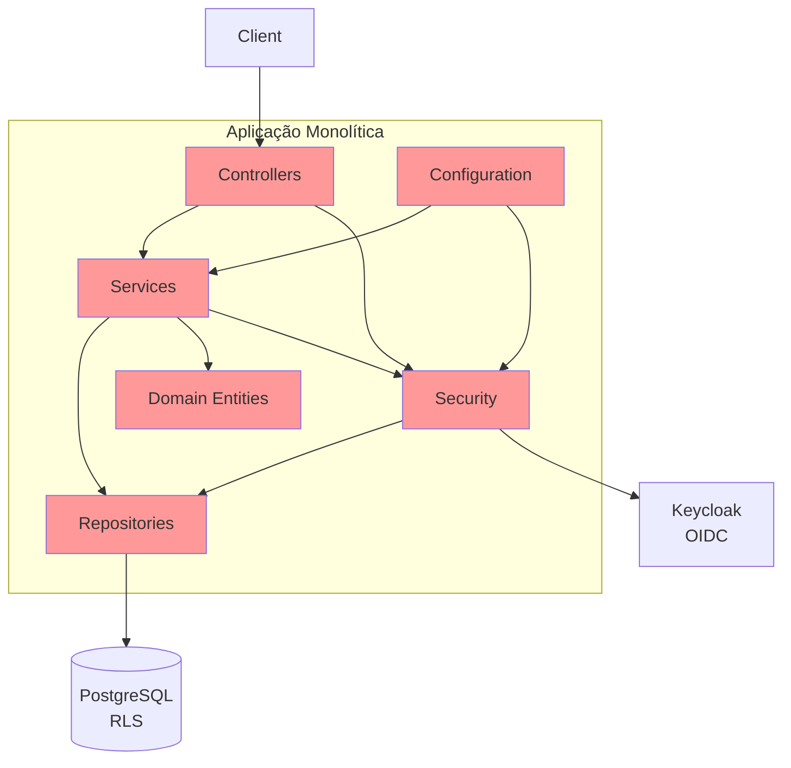
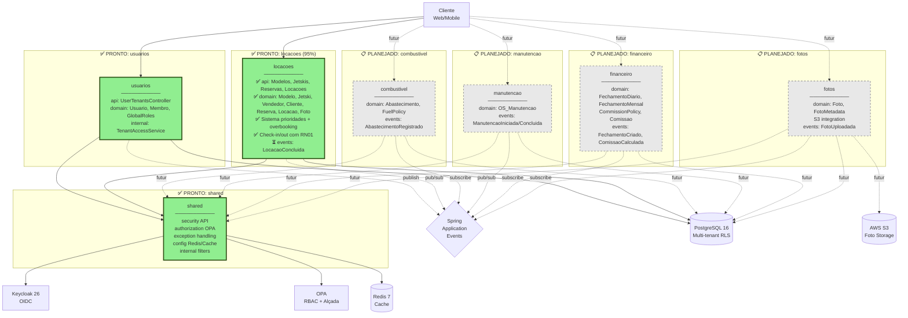
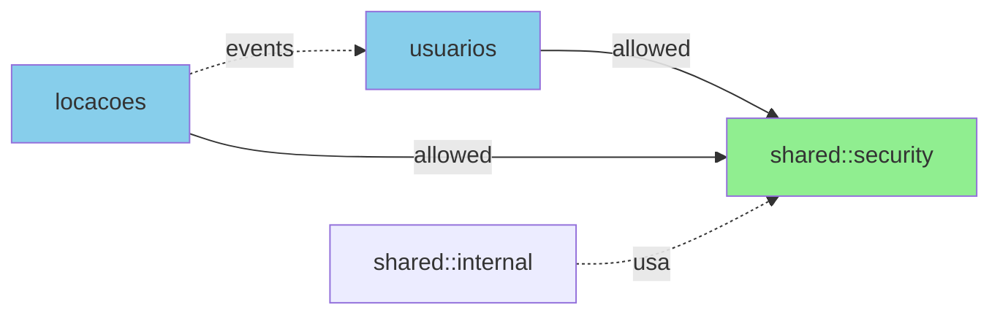
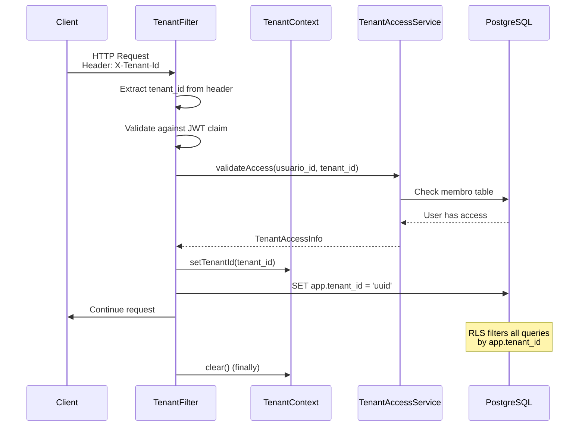

# Jetski SaaS - Backend API

[](https://openjdk.org/projects/jdk/21/)
[](https://spring.io/projects/spring-boot)
[](https://spring.io/projects/spring-modulith)
[](https://www.postgresql.org/)
[]()
[]()
[]()

API REST multi-tenant para gestão de locações de jetski, implementada como **Monolito Modular** usando Spring Modulith.

## 📊 Evolução Arquitetural

### AS IS - Monolito Tradicional (até v0.1.0)



**Problemas:**
- ❌ Acoplamento alto entre componentes
- ❌ Dependências circulares (shared ↔ usuarios)
- ❌ Difícil entender limites de contexto
- ❌ Testes validam apenas funcionalidade, não arquitetura
- ❌ Preparação para microserviços complexa

### TO BE - Monolito Modular Completo (v1.0+ Planejado)



**Legenda de Status:**
- ✅ **Verde sólido** (#90EE90) - Módulo PRONTO e em produção
- 🚧 **Amarelo sólido** (#FFD700) - Módulo EM PROGRESSO (próximo)
- 📋 **Cinza tracejado** (#E8E8E8) - Módulo PLANEJADO (futuro)

**Módulos Planejados:**
1. ✅ **shared** - Infraestrutura compartilhada (security, auth, config)
2. ✅ **usuarios** - Gestão de usuários e membros multi-tenant
3. ✅ **locacoes** - Core business: Modelos, Jetskis, Reservas, Locações (95% completo - Sprint 1 + 2 done)
4. 📋 **combustivel** - Gestão de abastecimento e políticas de cobrança
5. 📋 **manutencao** - Ordens de serviço e controle de disponibilidade
6. 📋 **financeiro** - Fechamentos diário/mensal e comissões
7. 📋 **fotos** - Upload S3, metadata, integração com locações

**Benefícios Alcançados:**
- ✅ Módulos com limites claros e acoplamento baixo
- ✅ Inversão de dependência (shared define interface, usuarios implementa)
- ✅ Testes automatizados de arquitetura (Spring Modulith)
- ✅ Documentação automática de módulos (PlantUML)
- ✅ Preparado para evolução gradual para microserviços
- ✅ Comunicação via eventos entre módulos (próximo)

**Ver arquitetura completa:** [docs/ARCHITECTURE_COMPLETE.md](./docs/ARCHITECTURE_COMPLETE.md)

## 🏗️ Arquitetura de Módulos

### Estrutura Atual

```
com.jetski/
├── shared/                        # Módulo: Shared Infrastructure
│   ├── security/                  # ✅ Named Interface (API pública)
│   │   ├── TenantAccessValidator  # Interface
│   │   ├── TenantAccessInfo       # DTO
│   │   ├── TenantContext          # ThreadLocal
│   │   └── SecurityConfig         # Security configuration
│   ├── authorization/             # OPA integration
│   │   ├── OPAAuthorizationService
│   │   └── dto/
│   ├── exception/                 # Exception handling
│   ├── config/                    # Shared configuration
│   └── internal/                  # 🔒 Implementação privada
│       ├── TenantFilter
│       ├── JwtAuthenticationConverter
│       └── FilterChainExceptionFilter
│
├── usuarios/                      # Módulo: Users and Members
│   ├── api/                       # ✅ API pública
│   │   ├── UserTenantsController
│   │   ├── UserInvitationController    # ✨ NEW (v0.5.0)
│   │   ├── AccountActivationController # ✨ NEW (v0.5.0)
│   │   ├── TenantMemberController      # ✨ NEW (v0.5.0)
│   │   └── dto/
│   ├── domain/                    # Entidades de domínio
│   │   ├── Usuario
│   │   ├── Membro
│   │   ├── Convite                     # ✨ NEW (v0.5.0)
│   │   └── event/
│   │       └── UserAccountActivatedEvent # ✨ NEW (v0.5.0)
│   └── internal/                  # 🔒 Implementação privada
│       ├── TenantAccessService    # Implementa TenantAccessValidator
│       ├── UserInvitationService        # ✨ NEW (v0.5.0)
│       ├── MemberManagementService      # ✨ NEW (v0.5.0)
│       ├── UserActivationEmailListener  # ✨ NEW (v0.5.0)
│       ├── UsuarioGlobalRoles
│       └── repository/
│           ├── MembroRepository
│           ├── ConviteRepository        # ✨ NEW (v0.5.0)
│           └── UsuarioGlobalRolesRepository
│
└── locacoes/                      # Módulo: Rentals (futuro)
    ├── api/
    ├── domain/
    └── internal/
```

### Regras de Dependência



**Princípios:**
1. Módulos de domínio (`usuarios`, `locacoes`) podem depender de `shared::security`
2. Nenhum módulo pode acessar `internal/` de outros módulos
3. Comunicação entre módulos de domínio via eventos (loose coupling)
4. Shared não pode depender de módulos de domínio (Dependency Inversion)

## 🚀 Tecnologias

### Core
- **Java 21** - LTS release com Virtual Threads
- **Spring Boot 3.3** - Framework principal
- **Spring Modulith 1.1.3** - Validação de arquitetura modular
- **Maven 3.9+** - Build tool

### Persistência
- **PostgreSQL 16** - Database com Row Level Security (RLS)
- **Flyway 10** - Database migrations
- **Spring Data JPA** - ORM
- **HikariCP** - Connection pooling

### Segurança
- **Keycloak 26 (OSS)** - Identity Provider (OIDC)
- **Spring Security 6** - Authentication & Authorization
- **OAuth2 Resource Server** - JWT validation
- **OPA (Open Policy Agent)** - Policy-based authorization (RBAC + Alçada)

### Cache & Messaging
- **Redis 7** - Distributed cache (tenant access, sessions)
- **Spring Application Events** - Comunicação entre módulos

### Observabilidade
- **Spring Boot Actuator** - Health checks, metrics
- **Logback** - Structured logging
- **JaCoCo** - Code coverage

### Testes
- **JUnit 5** - Unit tests framework
- **Mockito** - Mocking framework
- **AssertJ** - Fluent assertions
- **Testcontainers** - Integration tests com PostgreSQL
- **MockMvc** - API testing
- **ArchUnit** (via Spring Modulith) - Architecture tests

## 📋 Pré-requisitos

- Java 21+ (OpenJDK ou Oracle JDK)
- Maven 3.9+
- Docker & Docker Compose (para serviços)
- Git

## 🔧 Setup

### 1. Clone do repositório

```bash
git clone <repository-url>
cd jetski/backend
```

### 2. Subir serviços de infraestrutura

```bash
# Da raiz do projeto
cd ..
make up

# Ou manualmente
docker-compose up -d postgres redis keycloak opa
```

Serviços disponíveis:
- PostgreSQL: `localhost:5432` (dev) / `localhost:5433` (local)
- Redis: `localhost:6379`
- Keycloak: `http://localhost:8080` (dev) / `http://localhost:8081` (local)
- OPA: `http://localhost:8181`

### 3. Configurar Keycloak

```bash
# Script automatizado de setup
./infra/keycloak-setup/setup-keycloak.sh

# Ou manualmente via Admin Console:
# http://localhost:8080/admin (admin/admin)
```

### 4. Build e testes

```bash
# Build completo com testes
mvn clean install

# Build sem testes (mais rápido)
mvn clean install -DskipTests

# Apenas compilar
mvn clean compile
```

### 5. Rodar aplicação

#### Perfil LOCAL (desenvolvimento local)
```bash
# Usando Maven
SPRING_PROFILES_ACTIVE=local mvn spring-boot:run

# Ou via JAR
java -jar target/jetski-api-0.1.0-SNAPSHOT.jar --spring.profiles.active=local
```

#### Perfil DEV (Docker Compose)
```bash
SPRING_PROFILES_ACTIVE=dev mvn spring-boot:run
```

A API estará disponível em: **http://localhost:8090/api**

## 🧪 Testes

### Execução

```bash
# Todos os testes (89 testes)
mvn test

# Apenas testes unitários
mvn test -Dtest=*Test

# Apenas testes de integração
mvn test -Dtest=*IntegrationTest

# Testes de verificação modular
mvn test -Dtest=ModuleStructureTest

# Com relatório de cobertura
mvn clean verify
```

### Cobertura

```bash
# Gerar relatório JaCoCo
mvn jacoco:report

# Visualizar relatório
open target/site/jacoco/index.html
```

**Métricas atuais:**
- **341 testes passando** (100%)
- **62% line coverage** (target: 60%) ✅
- **48% branch coverage** (target: 48%) ✅

**Breakdown por suite:**
- `UserInvitationIntegrationTest`: 19 testes ✅
- `AccountActivationIntegrationTest`: 25 testes ✅
- `MemberManagementIntegrationTest`: 10 testes ✅
- `ReservaControllerTest`: 25 testes ✅ (NEW - Sprint 1: Reservas v0.3.0)
- `ModeloControllerTest`: 10 testes ✅
- `JetskiControllerTest`: 10 testes ✅
- `ClienteControllerTest`: 11 testes ✅
- `VendedorControllerTest`: 9 testes ✅

### Tipos de Testes

1. **Unit Tests** - Testes unitários com mocks
   - `TenantAccessServiceTest`
   - `TenantContextTest`
   - `OPAAuthorizationServiceTest`

2. **Integration Tests** - Testes com Spring context + Testcontainers
   - `AuthTestControllerIntegrationTest`
   - `ApplicationContextIntegrationTest`
   - `FlywayMigrationIntegrationTest`

3. **Architecture Tests** - Validação de estrutura modular
   - `ModuleStructureTest` (Spring Modulith)

## 🏛️ Multi-tenancy

### Estratégia de Isolamento

**Row Level Security (RLS)** do PostgreSQL:
- Todas as tabelas operacionais incluem coluna `tenant_id`
- Políticas RLS garantem isolamento automático
- Filtro aplicado transparentemente em todas as queries

### Fluxo de Requisição



### TenantContext

ThreadLocal que armazena o `tenant_id` durante a requisição:

```java
// Configurado automaticamente pelo TenantFilter
UUID tenantId = TenantContext.getTenantId();

// Uso em queries (automático via RLS)
@Query("SELECT m FROM Modelo m WHERE m.tenantId = current_setting('app.tenant_id')::uuid")
List<Modelo> findAllByTenant();
```

### TenantAccessService

Serviço que valida acesso de usuários a tenants:

```java
public interface TenantAccessValidator {
    TenantAccessInfo validateAccess(UUID usuarioId, UUID tenantId);
}

// Implementação em usuarios::internal
@Service
public class TenantAccessService implements TenantAccessValidator {
    // 1. Check unrestricted access (platform admin)
    // 2. Check membership via membro table
    // 3. Return access info with roles
}
```

**Tipos de acesso:**
- **Unrestricted** - Platform admin (acesso a qualquer tenant)
- **Member** - Usuário membro do tenant (roles específicos)
- **Denied** - Sem acesso ao tenant

### Exemplo de Requisição

```bash
# Listar modelos de um tenant específico
curl http://localhost:8090/api/v1/user/tenants \
  -H "Authorization: Bearer <jwt-token>" \
  -H "X-Tenant-Id: a0eebc99-9c0b-4ef8-bb6d-6bb9bd380a11"
```

## 📚 Endpoints

### Públicos (sem autenticação)

- `GET /api/actuator/health` - Health check
- `GET /api/actuator/info` - Application info
- `GET /api/swagger-ui.html` - Swagger UI
- `GET /api/v3/api-docs` - OpenAPI spec
- `GET /api/v1/auth-test/public` - Endpoint público de teste
- `POST /api/v1/auth/complete-activation` - Ativação com senha temporária (Option 2) ✨ NEW
- `POST /api/v1/auth/magic-activate` - Ativação via Magic Link JWT (Option 1) ✨ NEW

### Protegidos (requerem JWT + X-Tenant-Id)

**Usuários e Membros:**
- `GET /api/v1/user/tenants` - Listar tenants do usuário (requer JWT)
- `GET /api/v1/user/tenants/count` - Contar tenants do usuário (requer JWT)
- `POST /api/v1/tenants/{tenantId}/users/invite` - Convidar novo usuário (ADMIN_TENANT) ✨ NEW
- `GET /api/v1/tenants/{tenantId}/members?includeInactive={bool}` - Listar membros do tenant ✨ NEW
- `DELETE /api/v1/tenants/{tenantId}/members/{usuarioId}` - Desativar membro ✨ NEW

**AuthTest (endpoints de teste):**
- `GET /api/v1/auth-test/me` - Info do usuário autenticado
- `GET /api/v1/auth-test/operador-only` - Requer role OPERADOR
- `GET /api/v1/auth-test/manager-only` - Requer role GERENTE ou ADMIN_TENANT
- `GET /api/v1/auth-test/opa/rbac` - Teste de autorização RBAC via OPA
- `GET /api/v1/auth-test/opa/alcada` - Teste de alçada de aprovação via OPA

## 🔧 Configuração

### Perfis de Ambiente

**local** - Desenvolvimento local (padrão)
```yaml
server:
  port: 8090

spring:
  datasource:
    url: jdbc:postgresql://localhost:5433/jetski_local
    username: jetski
    password: local123

  security:
    oauth2:
      resourceserver:
        jwt:
          issuer-uri: http://localhost:8081/realms/jetski-saas

opa:
  base-url: http://localhost:8181
```

**dev** - Docker Compose
```yaml
spring:
  datasource:
    url: jdbc:postgresql://postgres:5432/jetski_dev

  security:
    oauth2:
      resourceserver:
        jwt:
          issuer-uri: http://keycloak:8080/realms/jetski-saas
```

**test** - Testes (Testcontainers)
```yaml
spring:
  datasource:
    url: jdbc:postgresql://localhost:<random>/jetski_test
```

### Variáveis de Ambiente

```bash
# Database
DB_URL=jdbc:postgresql://localhost:5432/jetski_dev
DB_USERNAME=jetski
DB_PASSWORD=dev123

# Keycloak
KEYCLOAK_ISSUER_URI=http://localhost:8080/realms/jetski-saas

# OPA
OPA_BASE_URL=http://localhost:8181

# Redis
REDIS_HOST=localhost
REDIS_PORT=6379

# Spring Profile
SPRING_PROFILES_ACTIVE=local
```

## 🧬 Migrations (Flyway)

### Estrutura

```
src/main/resources/db/migration/
├── V001__create_tenant_tables.sql      # Tabelas multi-tenant base
├── V002__create_operational_tables.sql  # Modelo, Jetski, Cliente, etc.
├── V003__create_support_tables.sql      # Tabelas de apoio
├── V004__create_composite_indexes.sql   # Índices compostos
├── V999__seed_data_dev.sql              # Seed data (apenas DEV)
├── V1000__create_global_roles_table.sql # Global roles
├── V1001__create_tenant_access_tables.sql
├── V1002__tenant_access_indexes.sql
├── V1003__seed_platform_admin.sql       # Platform admin user
├── V1004__create_user_invitation_tables.sql # ✨ NEW (v0.5.0)
├── V1005__add_email_tracking_to_convite.sql # ✨ NEW (v0.5.0)
├── V1006__fix_convite_unique_constraint.sql # ✨ NEW (v0.5.0)
├── V1007__remove_restrictive_email_format_constraint.sql # ✨ NEW (v0.5.0)
└── V9999__test_data.sql                 # Test data para integration tests
```

### Comandos

```bash
# Executar migrations
mvn flyway:migrate

# Ver status de migrations
mvn flyway:info

# Validar migrations
mvn flyway:validate

# Baseline (primeira vez em DB existente)
mvn flyway:baseline

# Limpar database (⚠️ cuidado!)
mvn flyway:clean
```

## 🏗️ Desenvolvimento

### Hot Reload

Spring Boot DevTools habilitado - mudanças em código disparam reload automático:

```xml
<dependency>
    <groupId>org.springframework.boot</groupId>
    <artifactId>spring-boot-devtools</artifactId>
    <scope>runtime</scope>
    <optional>true</optional>
</dependency>
```

### Lombok

Certifique-se de habilitar annotation processing na sua IDE:

**IntelliJ IDEA:**
1. Settings → Build, Execution, Deployment → Compiler → Annotation Processors
2. Enable annotation processing ✅

**VS Code:**
1. Instalar extensão "Lombok Annotations Support"

### Spring Modulith

Verificar estrutura modular:

```bash
# Rodar testes de arquitetura
mvn test -Dtest=ModuleStructureTest

# Gerar documentação de módulos
mvn test -Dtest=ModuleStructureTest#shouldGenerateModuleDocumentation

# Visualizar documentação
open target/spring-modulith-docs/modules.puml
```

Documentação gerada:
- `modules.md` - Documentação em Markdown
- `modules.puml` - Diagrama PlantUML de todos os módulos
- `<module>.puml` - Diagrama individual de cada módulo

### Adicionar Novo Módulo

1. Criar package `com.jetski.<nome-modulo>`
2. Criar `package-info.java` com anotação `@ApplicationModule`
3. Organizar estrutura: `api/`, `domain/`, `internal/`
4. Rodar `ModuleStructureTest` para validar

Exemplo:

```java
/**
 * Módulo de Locações
 */
@org.springframework.modulith.ApplicationModule(
    displayName = "Rentals",
    allowedDependencies = {"shared::security", "usuarios::api"}
)
package com.jetski.locacoes;
```

## 📊 Status do Projeto

### ✅ Implementado

- [x] Multi-tenant foundation (TenantContext, TenantFilter)
- [x] OAuth2/JWT authentication (Keycloak integration)
- [x] Multi-tenant access control (TenantAccessService)
- [x] OPA authorization (RBAC + Alçada)
- [x] Database migrations (Flyway)
- [x] Row Level Security (RLS)
- [x] Global exception handling
- [x] Redis caching
- [x] Integration tests (Testcontainers)
- [x] **Modular architecture (Spring Modulith)**
- [x] **Architecture tests**
- [x] **Module documentation generation**
- [x] **User Invitation flow (OIDC)**
- [x] **Account Activation**
- [x] **Member Management (list/deactivate)**
- [x] **Event-Driven Architecture (Spring Events)**
- [x] **Sprint 1: Reservas v0.3.0**
  - [x] Modelo-based booking (reserva por modelo, não jetski específico)
  - [x] Sistema de prioridades (ALTA com sinal, BAIXA sem sinal)
  - [x] Overbooking controlado (fator 1.5x configurável)
  - [x] Endpoints: confirmar-sinal, alocar-jetski, disponibilidade
  - [x] Expiração automática de reservas sem sinal
  - [x] 25 testes de integração completos
  - [x] Postman collection atualizada
- [x] **Sprint 2: Locações (Check-in/Check-out)** ✨ NEW
  - [x] Check-in from reservation (conversão de reserva)
  - [x] Walk-in check-in (sem reserva prévia)
  - [x] Check-out com RN01 (tolerância + arredondamento 15min)
  - [x] Validação de horímetro e cálculo de minutos
  - [x] Gestão de status do jetski (DISPONIVEL ↔ LOCADO)
  - [x] Entidades domain: Locacao, Foto, LocacaoStatus
  - [x] 24 testes unitários (LocacaoCalculatorServiceTest) - 100% passing ✅
  - [x] 5 endpoints REST para operações de locação
  - [x] Migrations: V1009, V1010, V1011

### 🚧 Em Progresso

- [ ] Módulo `locacoes` - Sprint 3: Fotos e S3
  - [ ] Upload de fotos com S3 presigned URLs
  - [ ] Validação de fotos obrigatórias (4 no check-in)
  - [ ] Integração com abastecimento
- [ ] Comunicação via mensageria distribuída (Kafka)
- [ ] API endpoints de domínio core business

### 📋 Backlog

- [ ] Módulo `manutencao` (OS Manutenção)
- [ ] Módulo `financeiro` (Fechamentos, Comissões)
- [ ] Módulo `fotos` (Upload S3, metadata)
- [ ] Migração gradual para microserviços (quando necessário)

## 🔗 Links Úteis

- [Especificação Inicial](../../inicial.md) - Documento completo de especificação
- [CLAUDE.md](../../CLAUDE.md) - Instruções para Claude Code
- [Spring Modulith Docs](https://docs.spring.io/spring-modulith/reference/)
- [Keycloak Setup](../infra/keycloak-setup/)
- [OPA Policies](../infra/opa/policies/)

## 📝 Licença

Proprietary - Jetski SaaS Project

---

**Versão:** 0.7.0-SNAPSHOT (Sprint 2: Locações Check-in/Check-out completo)
**Última atualização:** 2025-10-24
**Testes:** 365 tests passing ✅ (24 new unit tests for RN01)
**Coverage:** 62% lines | 48% branches ✅
