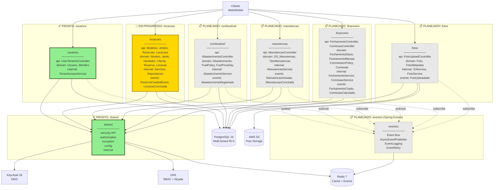
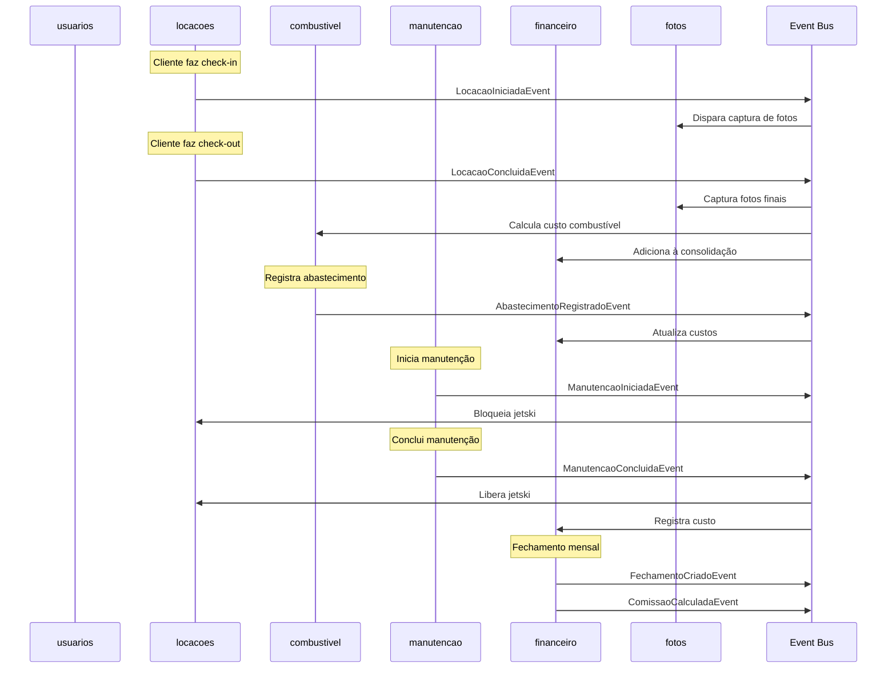
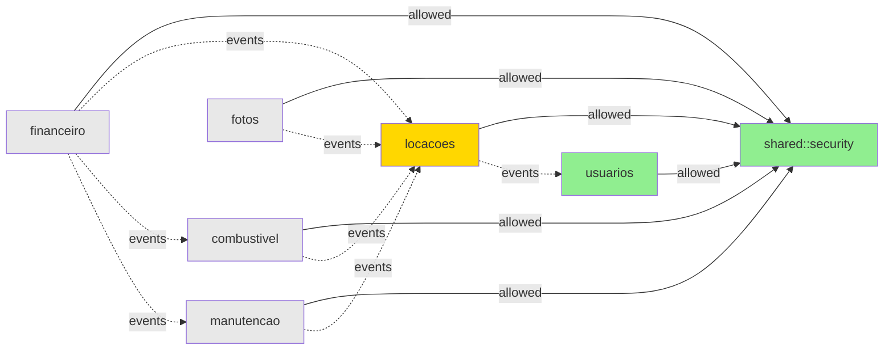

# 🏗️ Arquitetura Completa - Visão AS IS e TO BE

Este documento mostra a arquitetura completa do sistema, incluindo todos os módulos planejados.

---

## 📊 Visão Geral da Evolução

```
AS IS (v0.2.0 - Atual)     →     TO BE (v1.0+ - Futuro Completo)
━━━━━━━━━━━━━━━━━━━━━━━━━━━━━━━━━━━━━━━━━━━━━━━━━━━━━━━━━━━━━━━━

✅ 2 módulos prontos              ✅ 2 módulos prontos
                                  🚧 1 módulo em progresso
                                  📋 5 módulos planejados

   shared, usuarios         →     shared, usuarios, locacoes,
                                  combustivel, manutencao,
                                  financeiro, fotos, eventos
```

---

## AS IS - Estado Atual (v0.2.0-SNAPSHOT)

### Diagrama de Módulos Implementados

```mermaid
graph TB
    subgraph "✅ MÓDULO: shared (PRONTO)"
        direction TB

        subgraph "security (Named Interface)"
            SharedSec1[TenantAccessValidator]
            SharedSec2[TenantAccessInfo]
            SharedSec3[TenantContext]
            SharedSec4[SecurityConfig]
        end

        subgraph "authorization"
            SharedAuth1[OPAAuthorizationService]
            SharedAuth2[OPADecision, OPAInput]
        end

        subgraph "exception"
            SharedEx1[GlobalExceptionHandler]
            SharedEx2[InvalidTenantException]
            SharedEx3[ErrorResponse]
        end

        subgraph "config"
            SharedConf1[CacheConfig]
            SharedConf2[OPAConfig]
        end

        subgraph "internal (privado)"
            SharedInt1[TenantFilter]
            SharedInt2[JwtAuthenticationConverter]
            SharedInt3[FilterChainExceptionFilter]
        end
    end

    subgraph "✅ MÓDULO: usuarios (PRONTO)"
        direction TB

        subgraph "api"
            UserAPI1[UserTenantsController]
            UserAPI2[DTOs: TenantSummary, UserTenantsResponse]
        end

        subgraph "domain"
            UserDom1[Usuario]
            UserDom2[Membro]
        end

        subgraph "internal (privado)"
            UserInt1[TenantAccessService]
            UserInt2[UsuarioGlobalRoles]
            UserInt3[MembroRepository]
            UserInt4[UsuarioGlobalRolesRepository]
        end
    end

    Client[Cliente Web/Mobile] --> UserAPI1

    UserInt1 -.implements.-> SharedSec1
    SharedInt1 --> SharedSec1

    DB[(PostgreSQL 16<br/>com RLS)]
    UserInt3 --> DB
    UserInt4 --> DB

    KC[Keycloak 26<br/>OIDC Provider]
    SharedInt2 --> KC

    OPA[Open Policy Agent<br/>RBAC + Alçada]
    SharedAuth1 --> OPA

    Redis[(Redis 7<br/>Cache)]
    SharedConf1 --> Redis

    style SharedSec1 fill:#90EE90
    style SharedSec2 fill:#90EE90
    style SharedSec3 fill:#90EE90
    style SharedSec4 fill:#90EE90
    style SharedAuth1 fill:#87CEEB
    style SharedAuth2 fill:#87CEEB
    style SharedInt1 fill:#FFB6C1
    style SharedInt2 fill:#FFB6C1
    style SharedInt3 fill:#FFB6C1

    style UserAPI1 fill:#90EE90
    style UserAPI2 fill:#90EE90
    style UserDom1 fill:#87CEEB
    style UserDom2 fill:#87CEEB
    style UserInt1 fill:#FFB6C1
    style UserInt2 fill:#FFB6C1
    style UserInt3 fill:#FFB6C1
    style UserInt4 fill:#FFB6C1
```



**Legenda:**
- 🟢 **Verde (#90EE90)** - API Pública
- 🔵 **Azul (#87CEEB)** - Domain/Config
- 🔴 **Rosa (#FFB6C1)** - Internal (privado)

### Estatísticas AS IS

| Métrica | Valor |
|---------|-------|
| **Módulos Implementados** | 2 (shared, usuarios) |
| **Entidades de Domínio** | 2 (Usuario, Membro) |
| **Controllers** | 2 (AuthTestController, UserTenantsController) |
| **Repositories** | 2 (MembroRepository, UsuarioGlobalRolesRepository) |
| **Testes** | 89 (83 funcionais + 6 arquitetura) |
| **Cobertura** | 60% linha, 50% branch |

---

## TO BE - Arquitetura Completa Futura (v1.0+)

### Diagrama de Todos os Módulos Planejados



**Legenda de Status:**
- ✅ **Verde sólido** - Módulo PRONTO e em produção
- 🚧 **Amarelo sólido** - Módulo EM PROGRESSO
- 📋 **Cinza tracejado** - Módulo PLANEJADO (futuro)

---

## 🗺️ Mapa de Domínios Completo

### Módulos e suas Entidades

#### ✅ shared (Infraestrutura)
```
shared/
├── security/              # Multi-tenancy & Auth
│   ├── TenantAccessValidator
│   ├── TenantAccessInfo
│   ├── TenantContext
│   └── SecurityConfig
├── authorization/         # OPA integration
│   ├── OPAAuthorizationService
│   └── dto/
├── exception/            # Global exception handling
├── config/               # Redis, OPA configs
└── internal/             # Filters, converters
```

#### ✅ usuarios (Gestão de Usuários e Membros)
```
usuarios/
├── api/
│   ├── UserTenantsController
│   └── dto/
├── domain/
│   ├── Usuario            # Usuário global
│   ├── Membro             # Associação usuario-tenant
│   └── UsuarioGlobalRoles # Platform admin
└── internal/
    ├── TenantAccessService
    └── repository/
```

**Entidades:**
- `Usuario` - Conta de usuário (email, nome, ativo)
- `Membro` - Vínculo usuario-tenant com papéis (ADMIN_TENANT, GERENTE, OPERADOR)
- `UsuarioGlobalRoles` - Roles globais (PLATFORM_ADMIN, unrestricted_access)

#### 🚧 locacoes (Gestão de Locações e Operações)
```
locacoes/
├── api/
│   ├── ModeloController
│   ├── JetskiController
│   ├── VendedorController
│   ├── ClienteController
│   ├── ReservaController
│   └── LocacaoController
├── domain/
│   ├── Modelo             # Modelo de jetski (pricing)
│   ├── Jetski             # Unidade física (odometer, status)
│   ├── Vendedor           # Vendedor/Partner (comissões)
│   ├── Cliente            # Cliente final
│   ├── Reserva            # Booking (predicted times)
│   └── Locacao            # Rental real (check-in/out, photos)
└── internal/
    ├── ModeloService
    ├── JetskiService
    ├── ReservaService
    ├── LocacaoService
    └── repository/
```

**Entidades:**
- `Modelo` - Modelo de jetski (nome, pricing por hora/pacote)
- `Jetski` - Unidade física (patrimônio, odômetro, status: disponível/alugado/manutenção)
- `Vendedor` - Vendedor/parceiro (commission rules)
- `Cliente` - Cliente final (nome, CPF, contato)
- `Reserva` - Reserva de jetski (dt_inicio_prevista, dt_fim_prevista)
- `Locacao` - Locação real (check-in, check-out, odometer, valor_total, status)

**Eventos Publicados:**
- `ReservaCreatedEvent` - Quando reserva é criada
- `LocacaoIniciadaEvent` - Check-in realizado
- `LocacaoConcluidaEvent` - Check-out realizado

#### 📋 combustivel (Gestão de Combustível)
```
combustivel/
├── api/
│   ├── AbastecimentoController
│   └── FuelPolicyController
├── domain/
│   ├── Abastecimento      # Registro de abastecimento
│   ├── FuelPolicy         # Política de cobrança (incluso/medido/taxa)
│   └── FuelPriceDay       # Preço diário médio
└── internal/
    ├── AbastecimentoService
    ├── FuelCalculationService
    └── repository/
```

**Entidades:**
- `Abastecimento` - Registro de reabastecimento (litros, custo, tipo)
- `FuelPolicy` - Política de cobrança (incluso/medido/taxa fixa)
- `FuelPriceDay` - Preço médio do combustível por dia

**Eventos:**
- `AbastecimentoRegistradoEvent`
- Subscreve: `LocacaoConcluidaEvent` (calcular custo de combustível)

#### 📋 manutencao (Gestão de Manutenções)
```
manutencao/
├── api/
│   ├── ManutencaoController
│   └── dto/
├── domain/
│   ├── OS_Manutencao      # Ordem de serviço
│   ├── TipoManutencao     # Preventiva/Corretiva
│   └── ManutencaoItem     # Itens da OS
└── internal/
    ├── ManutencaoService
    ├── AgendamentoService
    └── repository/
```

**Entidades:**
- `OS_Manutencao` - Ordem de serviço (tipo, jetski, mecânico, status, custo)
- `TipoManutencao` - Preventiva, Corretiva, Inspeção
- `ManutencaoItem` - Peças e serviços realizados

**Eventos:**
- `ManutencaoIniciadaEvent` → Bloqueia jetski (status = manutenção)
- `ManutencaoConcluidaEvent` → Libera jetski (status = disponível)

**Regras:**
- Jetski em manutenção não pode ser reservado (RN06)
- OS aberta bloqueia automaticamente o scheduling

#### 📋 financeiro (Fechamentos e Comissões)
```
financeiro/
├── api/
│   ├── FechamentoController
│   ├── ComissaoController
│   └── dto/
├── domain/
│   ├── FechamentoDiario   # Consolidação diária
│   ├── FechamentoMensal   # Consolidação mensal
│   ├── CommissionPolicy   # Regras de comissão
│   └── Comissao           # Comissão calculada
└── internal/
    ├── FechamentoService
    ├── ComissaoService
    ├── RevenueCalculator
    └── repository/
```

**Entidades:**
- `FechamentoDiario` - Consolidação diária (receita, custos, comissões)
- `FechamentoMensal` - Fechamento mensal (com locking)
- `CommissionPolicy` - Hierarquia de regras (campanha/modelo/duração/vendedor)
- `Comissao` - Comissão calculada por vendedor/locação

**Eventos:**
- `FechamentoCriadoEvent`
- `ComissaoCalculadaEvent`
- Subscreve: `LocacaoConcluidaEvent`, `AbastecimentoRegistradoEvent`

**Regras:**
- Comissão calculada apenas no fechamento mensal (RN04)
- Revenue comissionável = valor_locacao - combustível - taxas - multas (RN08)
- Hierarquia: campanha > modelo > duração > vendedor default

#### 📋 fotos (Gestão de Fotos e Storage)
```
fotos/
├── api/
│   ├── FotoUploadController
│   └── dto/
├── domain/
│   ├── Foto               # Metadata de foto
│   └── FotoMetadata       # EXIF, hash, etc.
└── internal/
    ├── S3Service
    ├── FotoService
    ├── ImageProcessor
    └── repository/
```

**Entidades:**
- `Foto` - Registro de foto (S3 key, tipo, timestamp, locacao_id)
- `FotoMetadata` - EXIF data, SHA-256 hash, compression

**Eventos:**
- `FotoUploadadaEvent`
- Subscreve: `LocacaoIniciadaEvent`, `LocacaoConcluidaEvent`

**Regras:**
- 4 fotos obrigatórias: check-in (2) + check-out (2) (RN05)
- Upload via presigned S3 URL
- Storage: `tenant_id/locacao/{id}/foto_{timestamp}.webp`

#### 📋 eventos (Event Bus e Mensageria)
```
eventos/
├── config/
│   ├── AsyncEventConfig
│   └── EventLoggingConfig
├── publisher/
│   ├── ApplicationEventPublisher (Spring)
│   └── AsyncEventPublisher
├── listeners/
│   └── EventLogger
└── retry/
    └── EventRetryPolicy
```

**Infraestrutura:**
- Spring Application Events (síncronos)
- @Async Events (assíncronos)
- Event logging para auditoria
- Retry policy para eventos falhados

---

## 📊 Estatísticas Projetadas

### TO BE Completo (v1.0)

| Métrica | v0.2.0 (Atual) | v1.0 (Futuro) | Crescimento |
|---------|----------------|---------------|-------------|
| **Módulos** | 2 | 8 | +300% |
| **Entidades de Domínio** | 2 | 20+ | +900% |
| **Controllers** | 2 | 15+ | +650% |
| **Eventos** | 0 | 10+ | ∞ |
| **Repositories** | 2 | 20+ | +900% |
| **Testes Estimados** | 89 | 300+ | +237% |

### Distribuição de Entidades por Módulo

```
shared:        0 entidades (apenas infraestrutura)
usuarios:      3 entidades (Usuario, Membro, UsuarioGlobalRoles)
locacoes:      6 entidades (Modelo, Jetski, Vendedor, Cliente, Reserva, Locacao)
combustivel:   3 entidades (Abastecimento, FuelPolicy, FuelPriceDay)
manutencao:    3 entidades (OS_Manutencao, TipoManutencao, ManutencaoItem)
financeiro:    4 entidades (FechamentoDiario, FechamentoMensal, CommissionPolicy, Comissao)
fotos:         2 entidades (Foto, FotoMetadata)
eventos:       0 entidades (apenas event bus)
───────────────────────────────────────────────────────────
TOTAL:        21 entidades de domínio
```

---

## 🔄 Fluxo de Eventos Entre Módulos



---

## 🗓️ Roadmap de Implementação

### Fase 1: Fundação ✅ (Concluída)
- [x] Módulo `shared`
- [x] Módulo `usuarios`
- [x] Testes de arquitetura
- [x] Documentação completa

### Fase 2: Core Business 🚧 (Em Progresso)
- [ ] Módulo `locacoes` (70% - próximo)
  - [ ] Domain models
  - [ ] Repositories
  - [ ] Services
  - [ ] Controllers
  - [ ] Eventos básicos
- [ ] Comunicação via eventos

### Fase 3: Operações 📋 (Q1 2026)
- [ ] Módulo `combustivel`
- [ ] Módulo `manutencao`
- [ ] Módulo `fotos`
- [ ] Event bus completo

### Fase 4: Financeiro 📋 (Q2 2026)
- [ ] Módulo `financeiro`
- [ ] Fechamentos diário/mensal
- [ ] Comissões
- [ ] Relatórios

### Fase 5: Otimização 📋 (Q3 2026)
- [ ] Performance tuning
- [ ] Caching avançado por módulo
- [ ] Observabilidade completa
- [ ] Métricas de negócio

### Fase 6: Evolução (Se Necessário) 📋 (Q4 2026+)
- [ ] Avaliar necessidade de microserviços
- [ ] Kafka para eventos (se volume justificar)
- [ ] Extração de módulos críticos
- [ ] Service mesh (se distribuído)

---

## 🎯 Princípios Arquiteturais

### 1. Modularidade
- Cada módulo é independente
- Comunicação via interfaces públicas
- Internal nunca exposto

### 2. Eventos como Primeira Classe
- Módulos se comunicam via eventos
- Loose coupling entre domínios
- Async quando possível

### 3. Single Responsibility
- Cada módulo tem um domínio claro
- Sem mistura de responsabilidades
- Boundaries bem definidos

### 4. Preparado para Escala
- Módulos podem virar microserviços
- Eventos podem virar mensageria (Kafka)
- Stateless quando possível

---

## 📐 Regras de Dependência (Completo)



**Regras:**
- ✅ Todos os módulos podem depender de `shared::security`
- ❌ Nenhum módulo pode depender diretamente de outro módulo de domínio
- ✅ Comunicação entre domínios APENAS via eventos
- ❌ Shared não pode depender de módulos de domínio

---

## 🔍 Comparação de Complexidade

### Desenvolvimento

| Aspecto | Monolito Tradicional | Monolito Modular | Microserviços |
|---------|---------------------|------------------|---------------|
| **Setup Inicial** | 🟢 Simples | 🟡 Médio | 🔴 Complexo |
| **Adicionar Feature** | 🔴 Arriscado | 🟢 Seguro | 🟡 Médio |
| **Comunicação** | 🟢 Método direto | 🟡 Eventos | 🔴 REST/gRPC |
| **Deploy** | 🟢 Único | 🟢 Único | 🔴 Múltiplos |
| **Debugging** | 🟢 Local | 🟢 Local | 🔴 Distribuído |
| **Testing** | 🔴 Tudo junto | 🟢 Por módulo | 🟡 Contrato |

### Operacional

| Aspecto | Monolito Tradicional | Monolito Modular | Microserviços |
|---------|---------------------|------------------|---------------|
| **Infraestrutura** | 🟢 1 servidor | 🟢 1 servidor | 🔴 N servidores |
| **Escalabilidade** | 🔴 Vertical | 🟡 Vertical | 🟢 Horizontal |
| **Custo** | 🟢 Baixo | 🟢 Baixo | 🔴 Alto |
| **Monitoramento** | 🟢 Simples | 🟢 Simples | 🔴 Complexo |
| **Latência** | 🟢 Baixa | 🟢 Baixa | 🔴 Rede |

**Conclusão:** Monolito Modular é ideal para o estágio atual (MVP → Scale-up)

---

**Versão:** 2.0
**Última atualização:** 2025-10-18
**Status:** Documento vivo - será atualizado conforme módulos forem implementados
