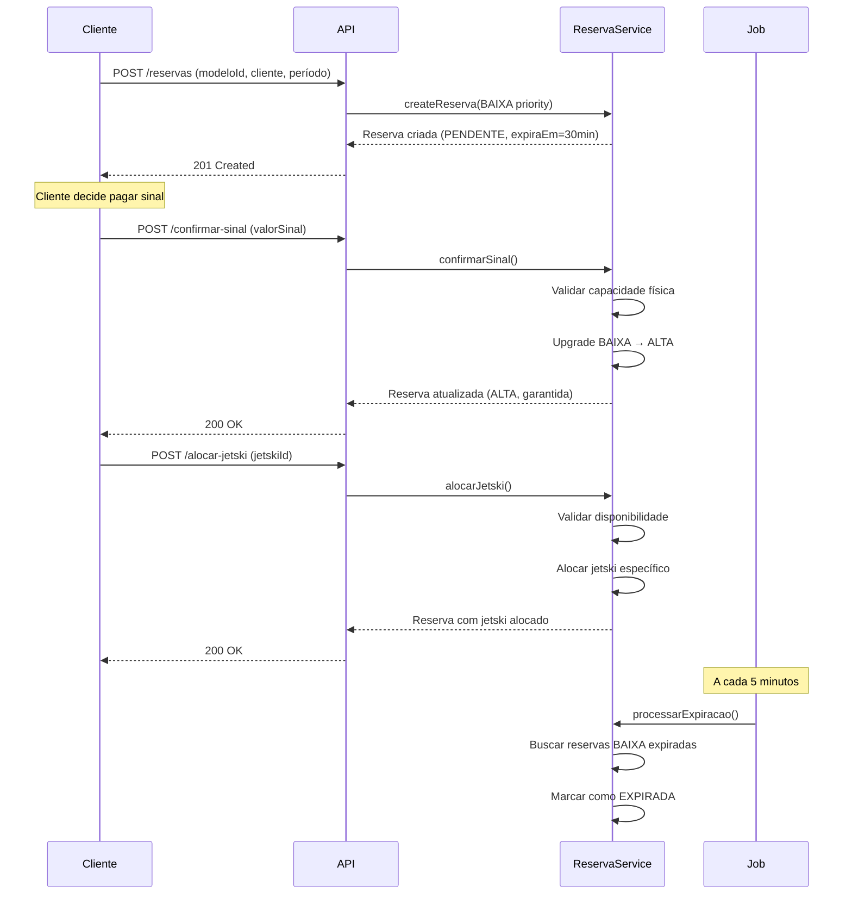

# STORY-006: Sistema de Reservas Modelo-based v0.3.0

## Como
Operador / Cliente do sistema

## Quero
Criar reservas por **modelo** de jetski (não unidade específica) com sistema de prioridades baseado em pagamento de sinal

## Para que
- Permitir maior flexibilidade nas reservas (cliente não precisa escolher jetski específico)
- Implementar overbooking controlado (aceitar mais reservas que capacidade física)
- Priorizar clientes que pagaram sinal (reservas garantidas)
- Expirar automaticamente reservas sem sinal que não comparecerem

## Critérios de Aceite

### Criação de Reserva
- [x] **CA1:** Cliente pode criar reserva informando apenas `modeloId` (jetskiId opcional)
- [x] **CA2:** Reserva criada sem sinal inicia com prioridade BAIXA e status PENDENTE
- [x] **CA3:** Sistema valida capacidade do modelo (pelo menos 1 jetski DISPONIVEL)
- [x] **CA4:** Sistema calcula `expiraEm` baseado em `dataInicio + gracePeriodMinutos` (default: 30min)
- [x] **CA5:** Validações básicas: dataInicio < dataFimPrevista, não pode ser no passado

### Sistema de Prioridades
- [x] **CA6:** Reserva com sinal pago → prioridade ALTA (garantida, bloqueia capacidade física)
- [x] **CA7:** Reserva sem sinal → prioridade BAIXA (permite overbooking, pode expirar)
- [x] **CA8:** Endpoint `POST /confirmar-sinal` permite upgrade BAIXA → ALTA
- [x] **CA9:** Ao confirmar sinal, valida capacidade física (garantidas < totalJetskis)

### Overbooking Controlado
- [x] **CA10:** Sistema permite criar reservas BAIXA até `ceil(totalJetskis × fatorOverbooking)`
- [x] **CA11:** Fator de overbooking configurável por tenant (default: 1.5x)
- [x] **CA12:** Exemplo: 10 jetskis × 1.5 = 15 reservas max (permite até 5 sem sinal)
- [x] **CA13:** Reservas ALTA bloqueiam capacidade física (não permite overbooking)

### Alocação de Jetski
- [x] **CA14:** Endpoint `POST /alocar-jetski` permite alocar jetski específico à reserva
- [x] **CA15:** Alocação segue FIFO: reservas com sinal primeiro, depois por dataInicio
- [x] **CA16:** Validações: jetski pertence ao modelo, status DISPONIVEL, sem conflitos

### Disponibilidade
- [x] **CA17:** Endpoint `GET /disponibilidade` retorna métricas detalhadas
- [x] **CA18:** Retorna: totalJetskis, reservasGarantidas, totalReservas, maximoReservas
- [x] **CA19:** Flags booleanas: aceitaComSinal, aceitaSemSinal

### Expiração Automática
- [x] **CA20:** Job @Scheduled executa a cada 5 minutos
- [x] **CA21:** Expira reservas BAIXA quando `expiraEm < now()`
- [x] **CA22:** Reservas ALTA (com sinal) NUNCA expiram automaticamente
- [x] **CA23:** Reserva expirada → status = EXPIRADA, ativo = false

## Tarefas Técnicas

### Domain
- [x] Adicionar campos à entidade Reserva:
  - `modeloId UUID` (required)
  - `jetskiId UUID` (nullable)
  - `prioridade ReservaPrioridade` (enum: ALTA, BAIXA)
  - `sinalPago Boolean` (default: false)
  - `valorSinal BigDecimal` (nullable)
  - `sinalPagoEm Instant` (nullable)
  - `expiraEm LocalDateTime` (nullable)
- [x] Criar enum `ReservaPrioridade` (ALTA, BAIXA)
- [x] Adicionar entidade `ReservaConfig` (tenant-specific settings)
- [x] Constraints de banco:
  - `CHECK (sinalPago = false OR prioridade = 'ALTA')`
  - `CHECK (sinalPago = false OR (valorSinal IS NOT NULL AND sinalPagoEm IS NOT NULL))`

### Service
- [x] Refatorar `ReservaService.createReserva()`:
  - Remover validação de overbooking para reservas BAIXA
  - Validar apenas se `totalJetskis > 0`
  - Calcular `expiraEm` baseado em config
- [x] Implementar `ReservaService.confirmarSinal()`:
  - Validar capacidade física antes de upgrade
  - Upgrade prioridade BAIXA → ALTA
  - Marcar `sinalPago = true`, registrar valor e timestamp
- [x] Implementar `ReservaService.alocarJetski()`:
  - Validar reserva está CONFIRMADA
  - Validar jetski pertence ao modelo
  - Validar jetski DISPONIVEL
  - Detectar conflitos de agenda
- [x] Implementar `ReservaService.checkDisponibilidade()`:
  - Contar jetskis disponíveis do modelo
  - Contar reservas garantidas (ALTA priority)
  - Calcular máximo de reservas (com overbooking)
  - Retornar flags de disponibilidade

### Jobs
- [x] Criar `ReservaExpiracaoJob`:
  - `@Scheduled(cron = "0 */5 * * * *")` - a cada 5 minutos
  - Query: `WHERE expiraEm <= NOW() AND sinalPago = false AND status IN ('PENDENTE', 'CONFIRMADA')`
  - Marcar como EXPIRADA

### API
- [x] Atualizar `ReservaController`:
  - `POST /confirmar-sinal` (ConfirmarSinalRequest → ReservaResponse)
  - `POST /alocar-jetski` (AlocarJetskiRequest → ReservaResponse)
  - `GET /disponibilidade?modeloId=&dataInicio=&dataFimPrevista=` (DisponibilidadeResponse)
- [x] Criar DTOs:
  - `ConfirmarSinalRequest` (valorSinal)
  - `AlocarJetskiRequest` (jetskiId)
  - `DisponibilidadeResponse` (métricas completas)
- [x] Atualizar `ReservaResponse`:
  - Adicionar campos: prioridade, sinalPago, valorSinal, sinalPagoEm, expiraEm

### Database
- [x] Migration `V1009__refactor_reserva_to_modelo.sql`:
  - Adicionar colunas: modeloId, prioridade, sinalPago, valorSinal, sinalPagoEm, expiraEm
  - Tornar jetskiId NULLABLE
  - Adicionar constraints
  - Criar índices

### Testes
- [x] 11 novos testes de integração em `ReservaControllerTest`:
  - `testConfirmarSinal_Success` - Confirmar sinal com sucesso
  - `testConfirmarSinal_AlreadyPaid` - Rejeitar se já pago
  - `testConfirmarSinal_InvalidAmount` - Valor inválido
  - `testAlocarJetski_Success` - Alocar jetski
  - `testAlocarJetski_AlreadyAllocated` - Jetski já alocado
  - `testAlocarJetski_DifferentModelo` - Jetski de modelo diferente
  - `testAlocarJetski_NotConfirmed` - Reserva não confirmada
  - `testAlocarJetski_JetskiNotAvailable` - Jetski indisponível
  - `testCheckDisponibilidade_Success` - Verificar disponibilidade
  - `testCreateReserva_ModeloBased_NoJetski` - Criar sem jetski
  - `testConfirmReserva_NoJetskiAllocated` - Confirmar sem jetski

### Postman Collection
- [x] Atualizar collection para v1.5.0:
  - Adicionar 3 novos endpoints
  - Atualizar descrição da seção Reservas
  - Fixar request body do Create Reserva (modeloId required)

## Definição de Pronto (DoD)

- [x] Todos os critérios de aceite validados
- [x] 25 testes de integração passando (era 14, +11 novos)
- [x] Cobertura: 62% lines, 48% branches (targets atingidos)
- [x] Build SUCCESS sem warnings
- [x] Postman collection atualizada e testada manualmente
- [x] README.md atualizado com novo status
- [x] Migration validada em ambiente de teste

## Resultados Alcançados

### Métricas
- **Testes:** 330 → 341 (+11)
- **ReservaControllerTest:** 14 → 25 testes
- **Cobertura linhas:** 40% → 62%
- **Cobertura branches:** 34% → 48%
- **Build time:** ~1:40 min

### Funcionalidades Entregues
1. ✅ Modelo-based booking completo
2. ✅ Sistema de prioridades (ALTA/BAIXA)
3. ✅ Overbooking controlado (1.5x)
4. ✅ 3 novos endpoints REST
5. ✅ Job de expiração automática
6. ✅ Postman collection v1.5.0

### Bugs Corrigidos
1. ✅ NullPointerException em `confirmReservation()` quando jetskiId null
2. ✅ Bloqueio incorreto de overbooking na criação de reservas
3. ✅ Campos faltantes no ReservaResponse DTO

## Fluxo de Negócio Implementado

## Próximos Passos

Esta story completa **Sprint 1: Reservas**. Próximo:

**Sprint 2: Locações** (STORY-007)
- Check-in (converter reserva → locação)
- Check-out (calcular valor com tolerância)
- Regra RN01: arredondamento de 15min
- Integração com fotos (presigned URLs S3)

## Links

- **Epic:** [EPIC-03: Reservas e Locações](../../stories/epics/epic-03-reservas-locacoes.md)
- **Migration:** `V1009__refactor_reserva_to_modelo.sql`
- **Testes:** `ReservaControllerTest.java`
- **Postman:** `Jetski-SaaS-API.postman_collection.json` (v1.5.0)
- **Especificação:** `inicial.md` (linhas 415-600 - BDD scenarios)

## Changelog

- 2025-10-24: História criada e concluída (Sprint 1)
